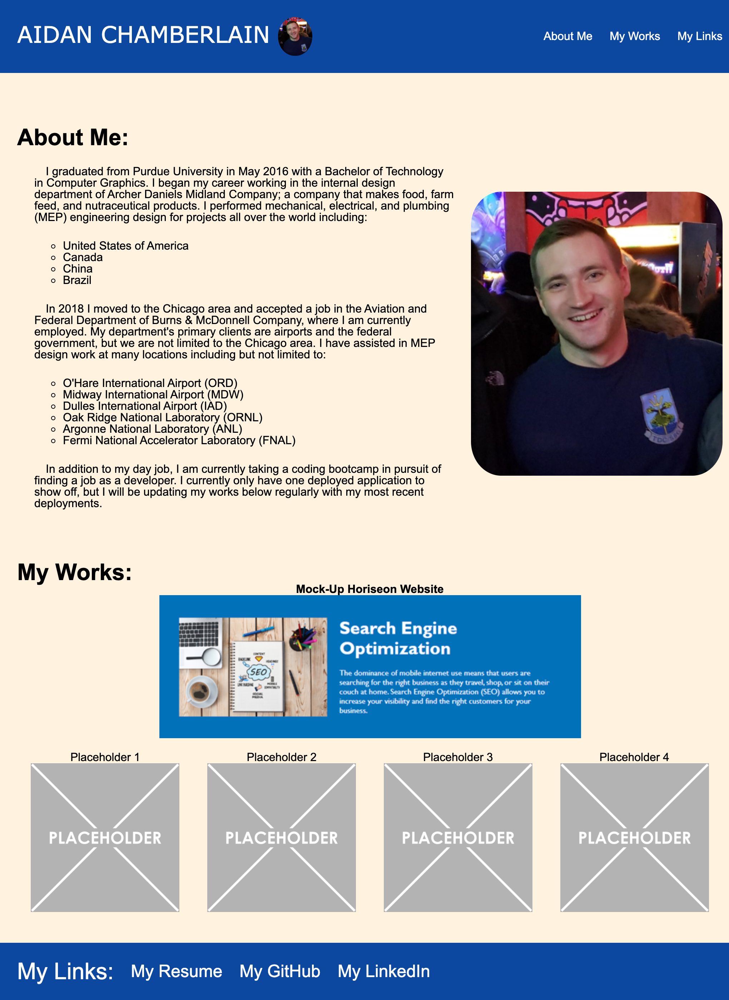

# 02 Advanced CSS: Portfolio

## Description

A portfolio website, providing information about me and examples of my deployed works so that a potential employer can determine if I the proper candidate for their open position. My portfolio contains information about me such as my name, a photo of me, and a brief summary of my life and work. My portfolio is broken into sections, which are linked to in the navigation bar. My portfolio is designed to be responsive to different screens and devices.

## Screenshot

## Links to Application

- Here is the repo: [RedComet6/hw1-b](https://github.com/RedComet6/hw2-Portfolio)
- Here is the pages: [RedComet6 hw1-b Pages](https://redcomet6.github.io/hw2-Portfolio/)
